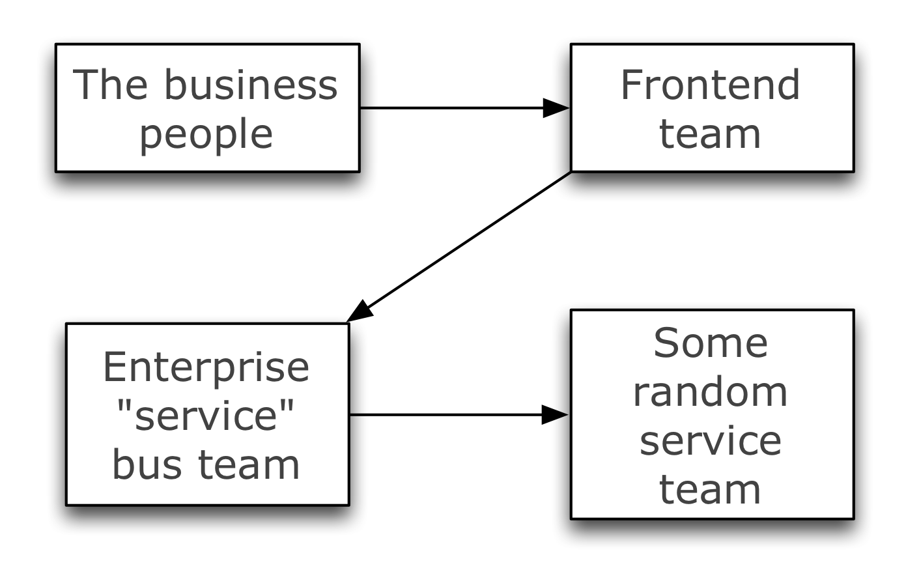
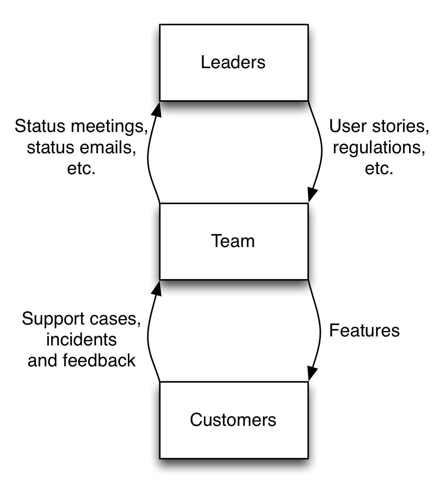

Organizing for Speed
====================

In this blogpost I will exlore some of the forces and organizational pitfalls affecting your team's ability to deliver value to your customers and what you should do to alleviate them.

Lead time is the time it takes you to complete a process, for instance from conceiving an idea to actually having something implemented in production. Shortening this lead time makes everything better. If you think it doesn't apply to you you're probably ripe for being naturally selected in a really really bad way.

For innovation to work optimally learning has to be as time and cost efficient as possible. A long lead time will reduce your learning rate. As deployment costs goes up the number of hypotheses you can run for the same amount of money goes down, thereby reducing the number of features you can try out before running out of money.

An organization can either optimize a value stream for _high utilization_ or _short lead time_, not both. Cost optimizing organizations tend to favor utilization as costs tend to go down (at least in the short term) if every employee is always busy. Responsiveness optimizing organizations tend to favor lead time since it makes innovation easier and makes customers more happy.

As a negative correlation exists between utilization and lead time you have to choose wisely. If what you develop depends on your responsiveness towards your customers or your ability to learn faster than your competitor, then you should choose low lead time over high utilization. As lead time goes down responsiveness goes up and the ability to learn increases. E.g. if your lead time is four weeks and your main competitor's is one week, your competitor will have had four opportunities for validating hypotheses and fixing bugs for every one opportunity you get.

The following advices assumes that you prefer _not_ to have long queues in your value streams.

Getting rid of feature handovers
--------------------------------

Anyone who has ever worked on anything with other people have experienced that the one thing impacting lead time the most is handovers. Some handovers we can't easily be without if we need people to specialize as developers, designers, and so on. Some handovers, though, we can avoid by designing our organization the right way.

Different teams have different goals and backlogs – it's why we split our organizations in multiple teams in the first place, to be able to work concurrently with more than one thing. And because different teams have different goals and backlogs they'll also have different priorities. Therefore, if an organization is designed in such a way that every feature needs to be handed over between multiple teams or departments, the work item will likely spend some time waiting for every team it goes through and as a consequence lead time goes up. That includes "thinking work" by business people and other people typically analyzing or assessing.

As long as you divide your people into teams you're going to have silos and suboptimization. Just by existing, teams act as barriers to communication and cooperation (this is due to them having different goals than other teams). This isn't necessarily bad. Good team boundaries reduces overhead and gives people focus [1]. What you need to do is to _organize your teams in a way that causes suboptimization to be as optimal as possible_. If you're optimizing for speed and agility, you want to reduce the number of handovers needed to deliver customer value and to test hypotheses. If that means increasing the number of handovers needed to implement _shared services_, so be it.

What you should do is to organize your teams around _business outcomes_ and not competencies or even applications [2]. A business outcome is something that is in itself valuable to a business. E.g. IT-operations or security solutions in themselves aren't valuable. They're only valuable because they help you deliver e.g. an internet store or a solution that let people apply for universities. Organizing around business outcomes depends on teams being cross-functional. They should contain all the competencies required to do their jobs and no-one should be part-time.

If you organize around competencies or applications you're most likely going to have a significant amount of handovers per feature you want implemented. If you organize around business outcomes – one outcome, one team – you'll avoid feature handovers. You might still have to endure handovers due to _shared services_ (e.g. a common style guide or common SSO solution), but such work doesn't have to be a part of every feature you implement, like frontend or database work probably will.

Shared services
---------------

Sometimes we need to get something done with a shared service to deliver value. This can be handing over applications to operations for deployment into production, adding configuration to a message broker or setting up virtual machines.

The people maintaining these shared services don't just hang around and wait for your every command. They too have backlogs and priorities different from your own. Therefore if you require their services by getting them to do something you're going to get idle time in your process, as you're getting involved in another team's process.

If you want teams who depend on these shared services to optimize for autonomy, these services should be self-serviced.

This way, you'll have turned a _process_ into a _resource_, and resources are much less intrusive and much easier to reuse across teams and projects. Take for instance an internal startup embedded in an established organization. This startup will require different processes to function. By turning the process into a resource you make it easier to reuse the capabilities you might have, and thereby possibly increasing your chances of being innovative as well [3].

In the case of operations, this is an area where public cloud really shines and on-premise operations platforms lag behind. The main reason why a public cloud provider is able to provide a self-serviced platform for many customers is because they have a lot of spare capacity. They're economically incentivized to do so. If it wasn't for spare capacity you'd get resource contentions between different clients and that would reduce their income. On-premise platform providers have economical incentives to _not_ have spare capacity, because spare capacity is wasted money. And that simply will not do if you're viewed as a cost center, as many on-premise operations platforms are. The unfortunate result is that the operations platform will become a scarce resource. Scarce resources are protected and protection will hurt autonomy.

Power vs. competence
--------------------

Having a short lead time alone isn't enough if your backlog is half garbage. Who among us haven't experienced product owners, architects or steering committees meddling in affairs of which they know little?

People inside the team are exposed to most of the feedback loops related to the development of the product or service. Seems natural doesn't it? Those who work with something on a daily basis know more about it than those who don't. They are more fit to make the right decisions, because of their knowledge, than people outside the team who don't see the whole picture.

Centralization of authority will have the same effect on your teams as handovers across teams will have. If your teams will have to ask a leader outside the team for permissions your lead time increase as this leader doesn't necessarily have the same priorities you have. Most likely you'll also spend time bringing them up to speed as they don't have the same level of knowledge that you have.

Generally, _as centralization of authority goes up, autonomy – and therefore lead time – goes down._

 

If you want to decrease centralization you can:
- Move the people with authority into the team.
- Take away their power. Give them an advisory function instead.
- Get rid of them.

Conclusion
----------

To sum it all up in a few questions you can ask yourself:

0. Should you optimize for high utilization or short lead time?
1. Can you organize your teams around business outcomes?
2. Can you make shared services self-serviced?
3. Can you give the team authority to make product-related decisions themselves?

None of these advices are all or nothing, but everytime you answer "no" or "no"-ish to some question you subtract from your ability to deliver.

Sources
-------

1. The Everything Store: Jeff Bezos and the Age of Amazon by Brad Stone
2. https://info.thoughtworks.com/download-agile-it-organization-design.html
3. The Innovators Dilemma by Clayton M. Christensen

Acknowledgements
----------------

Based on discussions with Gaute Rossnes, Stian Liknes and Thomas Arp in the Continuous Delivery focus group at Bekk Consulting, and Torstein Gjengedal and Stein Inge Morisbak.
