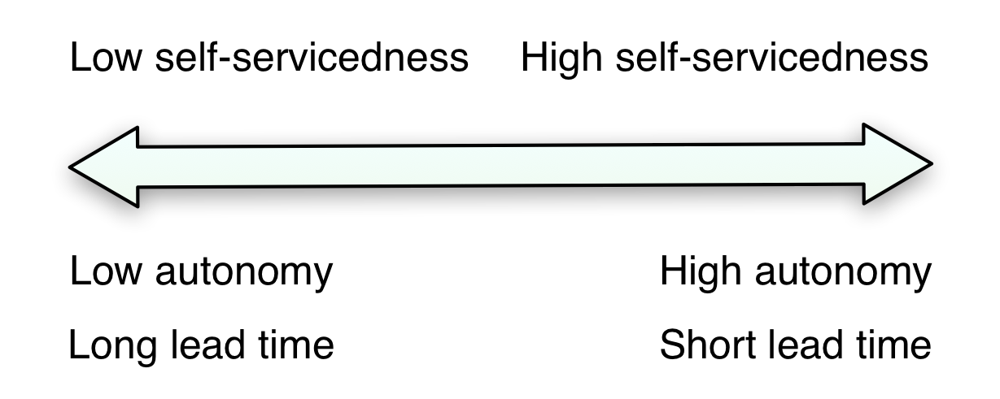

The Effect of Public Cloud on Team Autonomy
===========================================

Choosing to host your own operations platform in-house will result in many adverserial effects on your ability to deliver. Likewise, using public cloud will give benefits beside the usually mentioned technological ones. This blogpost will explain why public cloud is almost always systematically beneficial to your speed and autonomy, and what you should do if you're stuck with on-premise to not make everything grind to a halt.

Everything that needs to be done for every feature you develop has the potential to really mess up your lead time, throughput and general ability to deliver value. The operations part is no different. If you're optimizing for low lead time, you should generally try to make your development teams as autonomous as possible. When it comes to operations platforms you should only use those that are self-serviced.

Upfront investments in self-service platforms
---------------------------------------------

Cloud providers can invest a lot of resources upfront in hiding their operations processes behind a self-serviced operations platform. They simply have to if they want to scale independently of their number of ops people. At a sufficiently large scale automation and self-service is necessary to be profitable. Hence, public cloud providers are pretty incentivized to get out of your way as much as possible.

Smaller enterprises will have a harder time economically justifying building their own self-service platforms. As a result you'll experience process leakage, where the clients of the platform have to issue change orders instead of just doing it themselves.

As you can see above processes that stretches over multiple teams will invariably involve more waiting and reduced speed than processes that are confined to one team (see [Organizing for Speed](https://blogg.bekk.no/organizing-for-speed-17462894baf4)). Communication and handovers across team boundaries are a lot more discontinuous than within.

If you want to optimize your teams for speed and throughput you should only use operations platforms that are fully self-serviced. If you still need to use an on-premise platform, you should at the very least invest enough into it that the dev teams using it can do everything they need to do themselves without acting through intermediary ops people.

Spare capacity
--------------

Public cloud providers have a lot of spare capacity, which they're economically incentivized to have. Without spare capacity you'd get resource contentions between different clients and that would reduce their income. If you use an on-premise operations platform instead, something else happens. With on-prem you'll have economic incentives to _not_ have spare capacity, because spare capacity is wasted money. And that simply will not do if the on-premise operations platform is viewed as a cost center. The unfortunate result is that the operations platform will become a scarce resource. Scarce resources are protected and this protection will reduce autonomy.

E.g., imagine having an on-premise database as the main storage of your organization. Each team that needs storage gets their own separate spaces (or schemas) in this database. Now, an internal startup wants to test something radically new to try to beat your main competitor. As this organization has standardized on this database the internal startup has no choice but to use the same storage as everybody else. The difference between the internal startup and the other teams is that the startup has no idea how their new product is going to be used. If their product turns out to be a real hit they could very well end up spending a lot more of the databases resources than the organizations established products. In the worst case scenario new products ends up impacting the ability of established products to create customer value. The database administrators might well be aware of this and as a counter-measure institute control mechanisms to avoid anyone spending more resources than planned (for example with up-front performance testing). These control mechanisms are added development costs for the internal startup and therefore a competative disadvantage compared to their competitors.

Economic incentives
-------------------

Public cloud providers organize their services around [business outcomes](https://blogg.bekk.no/organizing-for-speed-17462894baf4). In-house operations departments organize around outputs as operations in itself isn't what they sell to their customers, unless they're the operations department of Amazon or Google.

Outcome oriented teams' budgets are directly influenced by how well their products and services perform. If they sell more their budgets (should atleast) increase too.

Operations teams' budgets are seldom a function of how their clients (the development teams) use them. Often their budgets are either fixed or tied to how many people are on the operations team.

If you find you cannot use public cloud, you should at the very least find a way to tie your operations teams budget directly changes in the market affecting the development teams. If not, you may very well find that you miss market opportunities just because operations doesn't have the resources and incentives to scale.

Fixed bare-minimum budgets < Fixed ample budgets < Budgets tied to demand

No matter how good your reasons for using on-prem over public cloud might otherwise be, these organizational forces will take their toll if you don't address them.

What if I still want to use on-premise
--------------------------------------

