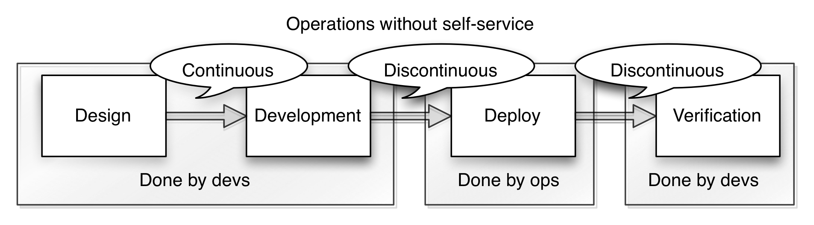

The Effects of Public Cloud on Team Autonomy
============================================

Having an internal team instead of an external corporation handling your infrastructure will have consequences for the autonomy and delivery speed of your development teams. These consequences are the manifestations of _economic incentives_ that are already managed correctly when using public cloud. Why? Because with public cloud you pay them per use and because public cloud must compete to survive. This blogpost will focus on how these incentives work in practice and what you should do if you are stuck with on-premise.

Infrastructure must be self-serviced
------------------------------------

Everything that needs to be done for every feature you develop has the potential to really mess up your lead time, throughput and general ability to deliver value. The operations part is no different. If you are optimizing for low lead time, you should generally try to make your development teams as autonomous as possible. For infrastructures (public cloud and on-premise) to enable autonomy for their clients, they _must_ be self-serviced.

Public cloud providers can invest a lot of resources upfront in hiding their operations processes behind a self-serviced operations platform. They simply have to if they want to scale independently of their number of operations employees. At a sufficiently large scale automation and self-service is necessary to be profitable. Hence, public cloud providers are very incentivized to get out of your way as much as possible.

Smaller enterprises will have a harder time economically justifying making their infrastructure truly self-serviced. As a result you will experience process leakage, where the clients of the platform for example have to issue change orders instead of just doing it themselves.

As you can see above, processes that stretches over multiple teams will invariably involve more waiting and reduced speed than processes that are confined to one team (see [Organizing for Speed](https://blogg.bekk.no/organizing-for-speed-17462894baf4)). Communication and handovers across team boundaries are a lot more discontinuous than within.

If you want to optimize your teams for speed and throughput you should only use infrastructures that are fully self-serviced. If you still need to use an on-premise platform, you should at the very least invest enough into it that the development teams using it can do everything they need to do themselves without involving anyone outside the team.

On-premise infrastructures can never compete with public cloud when it comes to their breadth of provided services. If you are stuck with on-premise and you suddenly realize that you need a service that the platform does not already provide (like a new kind of database) you will have to wait for the operations department to accept the change request, prioritize it, learn the technology, and then get it up and running. All these extra things operations need to do to support a new technology is nothing but added costs and waiting compared to public cloud.

You must have ample spare capacity
----------------------------------

Public cloud providers have a lot of spare capacity, which they are economically incentivized to have. Without spare capacity you would get resource contentions between different clients, which would result in the platform getting less attractive, which in turn means money lost for the provider.

If you use on-premise instead something else happens. With on-premise you will have economic incentives to _not_ have spare capacity, because spare capacity is wasted money. Very often operations is seen as a _cost center_. The negative part of being a cost center is that it drives you to cut costs, and in this case cutting spare capacity. The unfortunate result is that the infrastructures resources will become scarce. Scarce resources are protected and this protection will reduce autonomy.

For example, imagine having an on-premise database as the main storage of your organization. Each team that needs storage gets their own separate spaces (or schemas) in this database. Now, an internal startup wants to test something radically new to try to beat your main competitor. As this organization has standardized on this database the internal startup has no choice but to use the same storage as everybody else. The difference between the internal startup and the other teams is that the startup has no idea how their new product is going to be used and what their load on the database will be. If their product turns out to be a real hit they could very well end up eating into the database resources that the organizations established products need. In the worst case scenario new products ends up impacting the ability of established products to create customer value. The database administrators might well be aware of this possibility and as a counter-measure institute control mechanisms to avoid anyone spending more resources than planned (for example by demanding up-front performance testing for each release). These control mechanisms are added development costs for the internal startup and therefore a competative disadvantage compared to any competitor that does not have the same restrictions.

The budget of operations should be a function of their demand
-------------------------------------------------------------

Inside an organization you have two types of teams:
- The _outcome-oriented teams_ who deliver value to some external users or customers and are therefore the organization's reason for being.
- The _output-oriented teams_ who deliver some value only meant for consumption within the organization's walls and are therefore viewed as cost centers.

Public cloud providers organize their services around [business outcomes](https://blogg.bekk.no/organizing-for-speed-17462894baf4). In-house operations departments organize around outputs as operations in itself is not what they sell to their customers, unless they are the operations department of Amazon or Google.

Outcome oriented teams' budgets are directly influenced by how well their products and services perform. If they sell more their budgets should increase too to meet the extra demand. As the performance of product teams are so directly tied to the purpose (and profits if you are into money!) of the organization they will have an easier time justifying any budget increases compared to teams viewed as a cost center.

Operations teams' budgets are seldom a function of how their clients (the development teams) use them. Often their budgets are either fixed or tied to how many people are on the operations team.

The big problem with incentive models for development and operations looking like the two illustrations above, is that you are incentivizing development teams who are doing well to grow while at the same time you are telling operations to sit still and just dare to use a penny more! What happens? Bottlenecks.

With public cloud these incentives are alligned correctly by default. You need more infrastructure? Just open your wallet and pay up. If you cannot use public cloud for whatever reason, you should find a way to tie your operations teams budget directly to the demand expressed by your development teams. Or at the very least give your operations team a budget big enough for them to _not_ be scrooges. If you do not, you may very well find that you miss market opportunities just because operations does not have the resources and incentives to scale.

Conclusion
----------

I have shown you some of the benefits using public cloud has for your ability to deliver value, specifically:
- how willingness to invest upfront in hiding internal operational processes increases self-servicedness in the platform
- whether or not the platform is incentivized to have spare capacity affects the autonomy of the clients of the platform
- how well the budget of operations is a function of their demand

No matter how good your reasons for using on-premise over public cloud might otherwise be, the incentives covered will take their toll if you do not address them.
